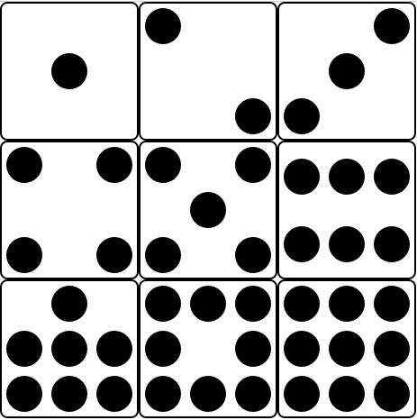

---

published:true
layout:post
title:flex布局
category:前端
tags:
  -前端
  -布局
time:2016.09.1 12:00:00
excerpt:Flex是Flexible Box的缩写，意思是“弹性布局”。任何一个容器都可以指定为Flex布局。不论是块状元素还是行内元素。

---

##Flex
`Flex`是`Flexible Box`的缩写，意思是“弹性布局”。任何一个容器都可以指定为Flex布局。不论是块状元素还是行内元素。 
块状元素:

	div{
		display:flex;
	}
行内元素：
	
	span{
		display:inline-flex;
	}
此外， `webkit` 内核浏览器必须加上 `webkit `前缀。	
### 1.容器的属性
**flex-direction** 主轴方向：

	div{
		flex-direction:row|row-reverse|column|column-reverse;
	}
**flex-wrap** 换行方式：

	div{
		flex-wrap:no-wrap|wrap|wrap-reverse;
	}
**justify-content** 主轴对齐方式：

	div{
		justify-content:flex-start|flex-end|center|space-between|space-around;
	}
**align-items** 交叉轴对齐方式：

	div{
		align-items:flex-start|flex-end|center|baseline|stretch;
	}
**align-content** 多轴线对齐方式：（单轴时忽略此属性）

	div{
		align-content:flex-start|flex-end|center|space-between|space-around|stretch;
	}
###2.项目的属性
**order**  排列顺序（默认为0）：可设置为负值，越小越靠前。

**flex-grow**  放大比例：默认为0，为0时，即使有空余空间也不放大。

**flex-shrink**  缩小比例：默认为1，为1时，即使空间不足，也不缩小。

**flex-basis**  定义分配空间前，项目占主轴空间。根据它，计算是否有多余空间，默认为auto；

**flex**  为 `flex-grow flex-shrink flex-basis` 的简写。

**align-self**  单个项目存在不同的对齐方式，可覆盖 `align-items` 的值，默认为 `auto` ，表示继承父元素的`align-items`的属性值。

###3.送自己一副色子
html：

	

		

			
		

		

			
			
		

		

			
			
			
		

		

			

				
				
			

			

				
				
			

		

		

			

				
				
			

			

				
			

			

				
				
			

		

		

			
			
			
			
			
			
		

		

			

				
			

			

				
				
				
			

			

				
				
				
			

		

		

			

				
				
				
			

			

				
				
			

			

				
				
				
			

		

		

			
			
			
			
			
			
			
			
			
		

	

css：
	
	.shaizi{
		width: 500px;
		height: 500px;
	}
	.div{
		width: 150px;
		height: 150px;
		border: solid 2px #000;
		border-radius: 8px;
		float: left;
	}
	.box1{
		display: flex;
		justify-content: center;
		align-items: center;
	}
	.box2{
		display: flex;
		justify-content: space-between;
	}
	.item2:nth-of-type(2){
		align-self: flex-end;
	}
	.box3{
		display: flex;
		flex-direction: row-reverse;
	}
	.item3:nth-of-type(2){
		align-self: center;
	}
	.item3:nth-of-type(3){
		align-self: flex-end;
	}
	.box4{
		display: flex;
		flex-wrap: wrap;
		align-content: space-between;
	}
	.column4{
		display: flex;
		justify-content: space-between;
		flex-basis: 100%;

	}
	.box5{
		display: flex;
		flex-wrap: wrap;
		align-content: space-between;
	}
	.column5{
		display: flex;
		justify-content: space-between;
		flex-basis: 100%;
	}
	.column5:nth-of-type(2){
		justify-content: center;
	}
	.box6{
		display: flex;
		flex-wrap: wrap;
		align-content: space-around;
	}
	.box7{
		display: flex;
		flex-wrap: wrap;
		align-content: space-between;
	}
	.column7{
		display: flex;
		flex-basis: 100%;
		justify-content: space-between;
	}
	.column7:nth-of-type(1){
		justify-content: center;
	}
	.box8{
		display: flex;
		flex-wrap: wrap;
		align-content: space-between;
	}
	.column8{
		display: flex;
		justify-content: space-between;
	}
	.column8:nth-of-type(2){
		flex-basis: 100%;
	}
	.box9{
		display: flex;
		flex-wrap: wrap;
	}
	.item1,.item2,.item3,.item4,.item5,.item6,.item7,.item8,.item9{
		width: 40px;
		height: 40px;
		margin: 5px;
		background: #000;
		border-radius: 50%;
	}

效果图：

